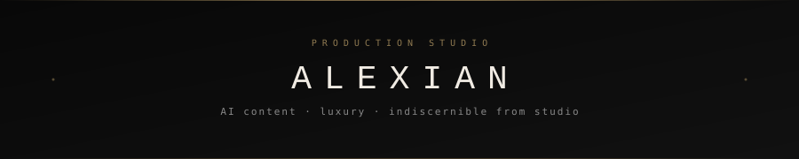
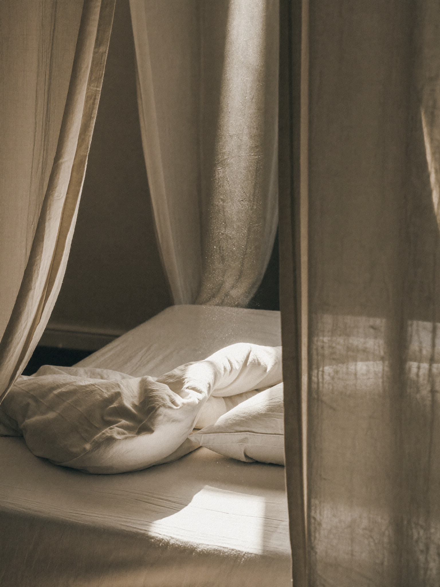
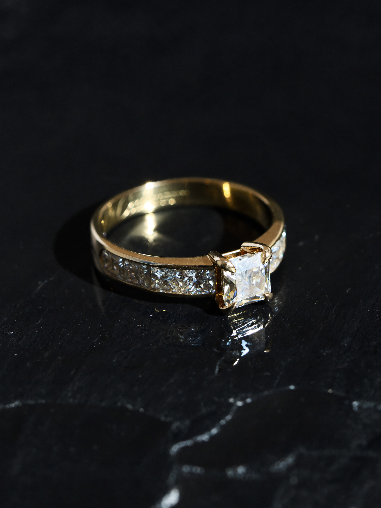
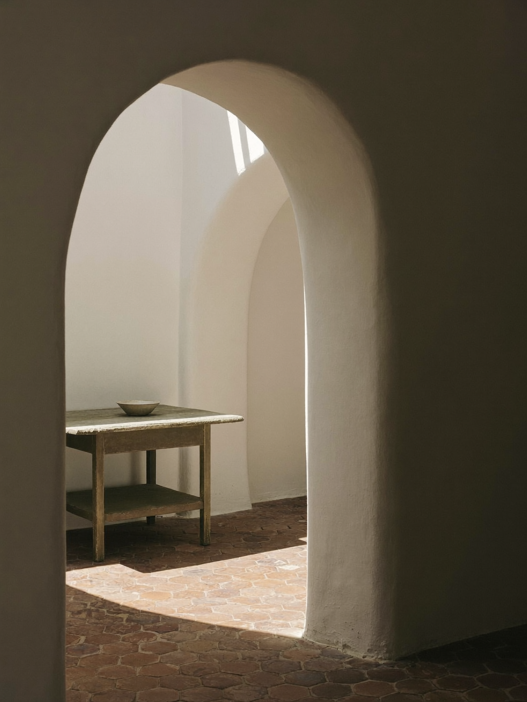
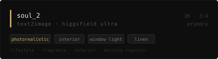
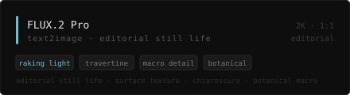
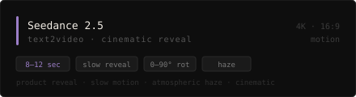
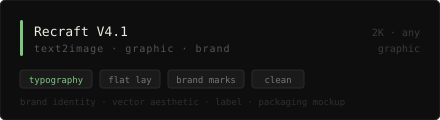

<picture>
  <source media="(prefers-color-scheme: dark)" srcset="header.svg">
  <source media="(prefers-color-scheme: light)" srcset="header.svg">
  
</picture>

<br/>

<div align="center">


</div>

<br/>

---

### `01` — Output

*What this system actually produces. Not renders — content indiscernible from studio work.*

<table>
<tr>
<td width="33%" align="center">

<br/><sub><code>soul_2</code> &nbsp;·&nbsp; fragrance &nbsp;·&nbsp; Replica intimate morning &nbsp;·&nbsp; seed 793656</sub>
</td>
<td width="33%" align="center">

<br/><sub><code>soul_2</code> &nbsp;·&nbsp; jewellery &nbsp;·&nbsp; gold 18k on obsidian &nbsp;·&nbsp; seed 287897</sub>
</td>
<td width="33%" align="center">

<br/><sub><code>soul_2</code> &nbsp;·&nbsp; gastronomy &nbsp;·&nbsp; Poulet de Bresse 45° &nbsp;·&nbsp; seed 224324</sub>
</td>
</tr>
<tr>
<td width="33%" align="center">

<br/><sub><code>soul_2</code> &nbsp;·&nbsp; luxury &nbsp;·&nbsp; saffron on travertine &nbsp;·&nbsp; raking 15°</sub>
</td>
<td width="33%" align="center">

<br/><sub><code>soul_2</code> &nbsp;·&nbsp; interiors &nbsp;·&nbsp; Pantelleria villa, lime plaster arch &nbsp;·&nbsp; harsh midday light</sub>
</td>
<td width="33%" align="center">
<br/><br/><br/>
<sub>more as they're shot</sub>
<br/><br/><br/>
</td>
</tr>
</table>

<br/>

---

### `02` — Model stack

*Four models. Each with a specific use case. None interchangeable.*



<br/>



<br/>



<br/>



<br/>

---

### `03` — Methodology

*Five open repositories. The complete production system across every luxury category.*

<table>
<tr>
<td width="50%" valign="top">

**[`higgsfield-luxury-prompts`](https://github.com/AlexianIulian/higgsfield-luxury-prompts)**

The core system. Surface taxonomy, lighting models, prompt architecture, Seedance 2.5 motion rules.

```
editorial/  reels/  supplements/
SYSTEM.md   CHANGELOG.md
```

</td>
<td width="50%" valign="top">

**[`higgsfield-fragrance-prompts`](https://github.com/AlexianIulian/higgsfield-fragrance-prompts)**

Three registers — intimate morning, dark opulent, botanical raw. Prompt kits per maison.

```
editorial/  reels/  maisons/
Maison Margiela · Byredo
```

</td>
</tr>
<tr>
<td width="50%" valign="top">

**[`higgsfield-jewellery-prompts`](https://github.com/AlexianIulian/higgsfield-jewellery-prompts)**

Three optical problems unique to jewellery — specular, transmitted light, subsurface. Metal and stone systems.

```
metals/  stones/  editorial/  reels/
gold · diamonds · Cartier register
```

</td>
<td width="50%" valign="top">

**[`higgsfield-interiors-prompts`](https://github.com/AlexianIulian/higgsfield-interiors-prompts)**

Camera height as editorial signal. Six registers from Van Duysen to Haussmannien. Time-of-day map.

```
residential/  hospitality/  reels/
Belgian minimal · Parisian · Scandi hotel
```

</td>
</tr>
<tr>
<td width="50%" valign="top">

**[`higgsfield-gastronomy-prompts`](https://github.com/AlexianIulian/higgsfield-gastronomy-prompts)**

Clock-face garnish positioning, sauce behaviour table, five plating angles. Haute cuisine to new Nordic.

```
registers/  lighting/  reels/
haute cuisine · Noma · Fäviken
```

</td>
<td width="50%" valign="top">
</td>
</tr>
</table>

<br/>

---

### `04` — Prompt anatomy

*The formula that runs through everything.*

```
[SUBJECT + STATE]  on/against  [SURFACE],
[LIGHT DIRECTION + KELVIN],    [COMPOSITION],
[PUBLICATION REFERENCE]  aesthetic,
[CAMERA + SPECS],
[EXCLUSIONS]
```

> **Name the reference. Never describe the quality.**
>
> `"Wallpaper* magazine editorial"` activates a complete visual register.  
> `"luxury"` activates whatever the internet thinks that means.

<br/>

---

### `05` — What fails and why

| Failure | Cause | Fix |
|:---|:---|:---|
| Generic "luxury" look | Descriptive adjective, no distribution target | Name the publication reference |
| Wrong surface register | Surface chosen after subject | Surface first — everything follows |
| Shadow fill where none wanted | Model three-point default | Explicit exclusion: `no ambient fill` |
| Video artifacts past 120° | Seedance 2.5 geometry limit | Max 90° rotation, single axis only |
| Label text unreadable | No model renders accurate packaging | Describe bottle form — not the label |

<br/>

---

### `06` — Pipeline

```
brief  →  surface decision  →  prompt build  →  Higgsfield Ultra
      →  review  →  upscale 4K  →  @alexianiulian
```

Orchestration: Claude Code (Sonnet 4.6) &nbsp;·&nbsp; Publishing: Upload-Post API

<br/>

---

<div align="center">
<sub>production work → <a href="https://instagram.com/alexianiulian">@alexianiulian</a></sub>
</div>
